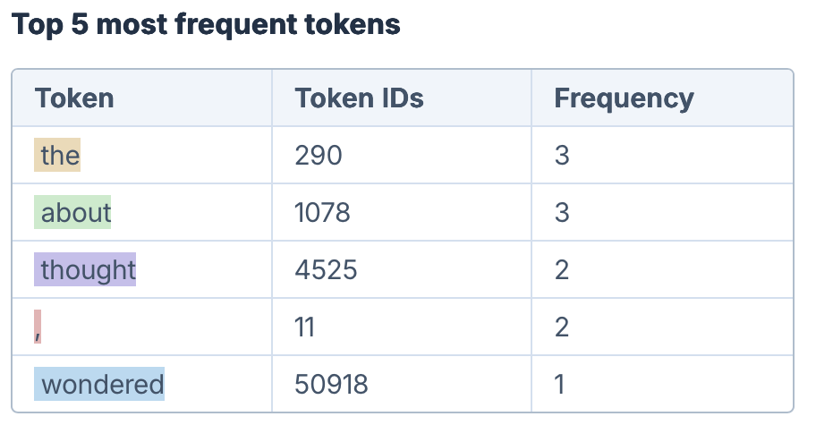

# 1. Introduction

It's been just over two years since large language models (LLMs) reached the general public and, for some, it still feels like magic how precise (or at least seemingly precise) their answers can be. But far from being any kind of magic, LLMs are simply models capable of processing and generating text after going through exhaustive training stages as Transformer layers, Backpropagation, Fine-Tuning and Reinforcement Learning.

However, for all this training to happen, a crucial yet often overlooked step must take place: the **Tokenization**. This is the first step of the process of converting text inputs into numbers so that machines can handle them. To achieve this, tokenizer models are trained to break text into smaller units called tokens, following a couple of specific rules and building their own dictionaries of these **tokens**, also called vocabularies. Once trained, the tokenizer can then map any new text into tokens and their IDs (indexes) by looking up matching pieces in its vocabulary. An example of the use of a pretrained tokenizer (in this case, the GPT tokenizer) is presented in Figure 1.[1,2]

### ***Figure 1: Illustrating the Tokenization Process***
<p align="center">


</p>


>***Caption.** Example of tokenization of an English sentence, showing both the tokenized text and the most frequent tokens with their IDs. Notice that the total number of tokens in the sentence is not the same as the number of unique dictionary entries, since repeated tokens share the same ID. The image was generated using gptforwork.com/tools/tokenizer. Try running your own experiments there to better understand how tokenization works!*
>
>***Source.** GPT for Work\'s Online Tokenizer, available at
<https://gptforwork.com/tools/tokenizer>.*

To make this idea more intuitive, we can think of Tokenization as the **chewing process in the digestive system**: just as chewing breaks food into smaller pieces so it can be swallowed and properly digested by stomach and intestines, tokenization breaks text into manageable units so that the subsequent training steps of LLMs - such as Transformers - can learn from the information, or in other words, extract nutrients from it.

There are a couple of different tokenization types and methods that we will go over in this article and to further understand their strengths and weaknesses, we propose four key metrics to evaluate them:

-   **Coverage** → How well can the tokenizer represent any possible input? Can it handle rare words, numbers, emojis, and multilingual text without gaps?

-   **Efficiency** → How compactly does the tokenizer encode text? Does it minimize the number of tokens per sentence while balancing vocabulary size and sequence length?

-   **Consistency** → How uniform are the segmentation patterns? Does the same word always get segmented the same way? Are there redundant tokens?

-   **Meaning Conservation** → Do the tokens generated have meaning unit? Does the tokenizer capture semantic relationships between similar words?

In short, achieving a consistent and efficient language model requires a well-designed tokenizer. This, in turn, demands training on a sufficiently large and diverse dataset to ensure a comprehensive vocabulary, so that no relevant text fragment is left unrepresented. At the same time, the tokenizer must segment the input into a reasonable number of tokens, avoiding both excessive fragmentation and redundancy.

## Setup

This section installs and configures all the dependencies required to run the notebook. The libraries listed below are essential for Natural Language Processing (NLP) tasks, data visualization, and text tokenization.

``` python
# If this is your first time running the notebook,
# you can uncomment and run the commands below to install the required package

# !pip -q install transformers==4.* sentencepiece spacy tiktoken matplotlib pandas
# !pip install numpy pandas matplotlib
# !python -m spacy download en_core_web_sm
```

### Utilities

``` python
from typing import List
import string
import io, re, unicodedata
import numpy as np
import pandas as pd
import token
import matplotlib.pyplot as plt
from matplotlib import colors
import tokenize, textwrap as _tw
from typing import Callable, Dict, List, Iterable
from textwrap import dedent

# Function to avoid wrong lenghts in the function below
def safe_len(fn, text):
    try:
        toks = fn(text)
        return len(toks)
    except Exception:
        return None

#Compute the number of tokens produced by multiple tokenizers for each sentence.
def compute_token_counts(
    tokenizers: Dict[str, Callable[[str], List[str]]],
    sentences: Dict[str, str]
) -> Dict[str, List[int]]:
    counts = {name: [] for name in tokenizers}
    for _, sent in sentences.items():
        for name, fn in tokenizers.items():
            n = safe_len(fn, sent)
            counts[name].append(n if n is not None else np.nan)
    return counts

#Plot a grouped bar chart comparing token counts across tokenizers and sentences.
def plot_token_counts(
    counts: Dict[str, List[int]],
    labels: Iterable[str],
    title: str = "Comparing Tokenization Levels"
):
    labels = list(labels)
    x = np.arange(len(labels))
    series = list(counts.items())
    width = 0.8 / max(1, len(series))

    plt.figure(figsize=(4, 3), dpi=150)
    for i, (name, values) in enumerate(series):
        plt.bar(x + i * width, values, width, label=name)

    plt.title(title)
    plt.ylabel("Number of Tokens")
    plt.xlabel("Sentence Size")
    plt.xticks(x + (len(series) - 1) * width / 2, labels)
    plt.grid(True, linestyle="--", alpha=0.6, axis="y")
    plt.legend(fontsize=7)
    plt.tight_layout()
    plt.show()

# Function to show the tokens of a text, for a specific tokenizer model
def subword_tokenizer(texts, tokenizer):
  for text in texts:
    # Return string tokens (subwords) before mapping to IDs
    tokens = tokenizer.tokenize(text)
    token_ids = tokenizer.convert_tokens_to_ids(tokens)

    # Display outputs to inspect token strings, token IDs, and decoder round-trips.
    print(f"Text: {text}")
    print("Tokens and their vocabulary indices:")

    # Create a pandas DataFrame for table formatting
    df = pd.DataFrame({'Token': tokens, 'Token ID': token_ids})
    display(df)
    print("\n")
```

### Load common tokenizers (first run may download models)


``` python
from transformers import AutoTokenizer

tok_bpe = AutoTokenizer.from_pretrained("gpt2")                 # BPE
tok_wp  = AutoTokenizer.from_pretrained("bert-base-uncased")    # WordPiece
tok_uni = AutoTokenizer.from_pretrained("google/mt5-small")     # Unigram (SentencePiece)

import spacy
nlp = spacy.load("en_core_web_sm")
```


#    
# 2. Word-Level Tokenization: the most intuitive alternative 

It is understandable that the tokenization concept almost automatically evokes the idea of breaking the text into **words**, after all, that is the way we are already used to (at least speakers of English and Romance Languages).

The most intuitive and simple idea is to split sentences at every whitespace, a process known as **Whitespace-Based Tokenization (WBT)**. This is a rule-based tokenization technique, meaning it follows a fixed rule without any learnable parameters to optimize how text is segmented. As a result, the training phase of these tokenizers focuses only on building a vocabulary of known words and assigning them unique IDs. This is typically done by setting a maximum vocabulary size *k* and selecting the *k* most frequent words from the training corpus [3].

Although being very straightforward, it has several notable limitations [1], beginning with its **language dependent coverage**. As long as words are separated by whitespaces, as in English, Portuguese or French, they can be tokenized by this method. However whitespaces are not the paradigm in all writing systems. Some languages such as Japanese, Chinese, Hebrew, Thai or Burmese do not have explicit word boundary markers as whitespaces, making WBT incapable of tokenizing its texts [4]. In section 6, tokenization of other languages is discussed.

Another issue with this approach is related to **consistency**. Since token boundaries are defined solely by whitespaces, words followed by punctuation are treated as completely new tokens (as shown in Example 1 of our Colab Notebook, resulting in multiple entries of the same word, one for each punctuation variation, being added to the vocabulary [2].

Furthermore, this method fails to **conserve meaning relationships** between compound words and their components. For example, it fails to connect "sunflower" with "sun", or "grandfather" with "father". These relationships must be learned in later training stages, which is more expensive. In addition, WBT cannot reuse tokens from the component words and instead creates entirely new tokens for each compound word.

These factors inflate the vocabulary size required to represent what is essentially the same set of words. And because the vocabulary size is predetermined, it actually means that more words are likely to fall outside of it - these are known as **Out-Of-Vocabulary words (OOVs)** - as a result of the presence of these duplicates. It either reduces the **efficiency** of the tokenizer, due to the larger dictionary, or limits its coverage by increasing the number of OOVs [2].

An alternative to the WBT is the **Punctuation-Based Tokenization (PBT)**. Beyond whitespaces, this model also uses the punctuation of sentences to separate words into tokens. In this way, each punctuation mark will be stored in a separate token, preventing words followed by punctuation from being treated as new tokens, as occurred in whitespace-based tokenization [1].

Although it might solve the problem of punctuation-copies, this tokenization model still retains most WBT issues and also presents a new flaw [2]: there are situations where punctuation is inside words - as in the case of e-mails, phone numbers, URLs or decimal points - and we don\'t want these units to be split apart as the PBT will do, because it loses its semantic value, as we can see in Example 1.

In short, neither of these two raw tokenization methods performs well enough to serve as a final tokenizer in large-scale language models today [5]. Nevertheless, several modern tokenization pipelines still rely on an initial segmentation of text into words before further subword processing.

In such cases, it is common to employ tokenizers such as **SpaCy** [6], that uses carefully crafted rules and lexical exceptions rather than simple whitespace or punctuation splitting, providing a more robust pre-processing stage for downstream subword tokenization methods.

It is interesting to add that while it is common to normalize text by converting all words to lowercase, simplifying vocabulary by treating "Cat" and "cat" as the same token, SpaCy takes a different approach: it preserves the original casing of tokens, despite its increased memory usage and duplicate entries. This choice enhances linguistic accuracy in downstream tasks such as Named Entity Recognition (NER), where capitalization can carry important semantic meaning (e.g., Apple vs. apple)[6].

By doing so, SpaCy retains contextual information that would otherwise be lost through normalization, while it still allows normalization for later processing stages that may require case-insensitive input [6].

### Example 1 - Comparison between Whitespace-Based, Punctuation-Based Tokenization and SpaCy Outputs 

> ***Caption.** This code compares three tokenization strategies: Whitespace-Based Tokenization (WBT), Punctuation-Based Tokenization (PBT), and SpaCy's rule-based tokenizer.*
>
> -   **WBT** simply splits text at whitespaces, leading to redundant tokens such as "programming." and "programming".
> -   **PBT** separates punctuation into independent tokens, solving the duplication issue but incorrectly fragmenting elements like email addresses or decimal numbers.
> -   **SpaCy** applies a linguistic, rule-based approach that accounts for punctuation, contractions, and special cases, preserving meaningful units like \"did\" + \"n\'t\", \"<tokenization.guy@mail.com>\" and \"\$1.234,56\".
>
> *The examples highlight the trade-offs between simplicity and linguistic precision across these tokenization methods.*

``` python
# Function for WBT tokenization
def manual_WBT(text):
    return text.split()

# Function for PBT tokenization
def manual_PBT(text):
    tokens = []
    current_token = ""
    for char in text:
        if char.isspace() or char in string.punctuation:
            if current_token:
                tokens.append(current_token)
                current_token = ""
            if char in string.punctuation:
                tokens.append(char)
        else:
            current_token += char
    if current_token:
        tokens.append(current_token)
    return tokens
```


``` python
CASES = [
    "I love programming. Programming challenges are fun!",
    "She said she'll call when she gets home.",
    "tokenization.guy@mail.com",
    "Didn't it cost $1.234,56, did it?"
]

# Display outputs to inspect token strings
for s in CASES:
    print("Text Input:", s)
    print("WBT Output:  ", manual_WBT(s))
    print("PBT Output:  ", manual_PBT(s))
    print("SpaCy Output:",[token.text for token in nlp(s)])

    print("-" * 100)
```

    Text Input: I love programming. Programming challenges are fun!
    WBT Output:   ['I', 'love', 'programming.', 'Programming', 'challenges', 'are', 'fun!']
    PBT Output:   ['I', 'love', 'programming', '.', 'Programming', 'challenges', 'are', 'fun', '!']
    SpaCy Output: ['I', 'love', 'programming', '.', 'Programming', 'challenges', 'are', 'fun', '!']
    ----------------------------------------------------------------------------------------------------
    Text Input: She said she'll call when she gets home.
    WBT Output:   ['She', 'said', "she'll", 'call', 'when', 'she', 'gets', 'home.']
    PBT Output:   ['She', 'said', 'she', "'", 'll', 'call', 'when', 'she', 'gets', 'home', '.']
    SpaCy Output: ['She', 'said', 'she', "'ll", 'call', 'when', 'she', 'gets', 'home', '.']
    ----------------------------------------------------------------------------------------------------
    Text Input: tokenization.guy@mail.com
    WBT Output:   ['tokenization.guy@mail.com']
    PBT Output:   ['tokenization', '.', 'guy', '@', 'mail', '.', 'com']
    SpaCy Output: ['tokenization.guy@mail.com']
    ----------------------------------------------------------------------------------------------------
    Text Input: Didn't it cost $1.234,56, did it?
    WBT Output:   ["Didn't", 'it', 'cost', '$1.234,56,', 'did', 'it?']
    PBT Output:   ['Didn', "'", 't', 'it', 'cost', '$', '1', '.', '234', ',', '56', ',', 'did', 'it', '?']
    SpaCy Output: ['Did', "n't", 'it', 'cost', '$', '1.234,56', ',', 'did', 'it', '?']
    ----------------------------------------------------------------------------------------------------

  \\
  # 
  # 3. Character-Level Tokenization: Breaking it all the way down
